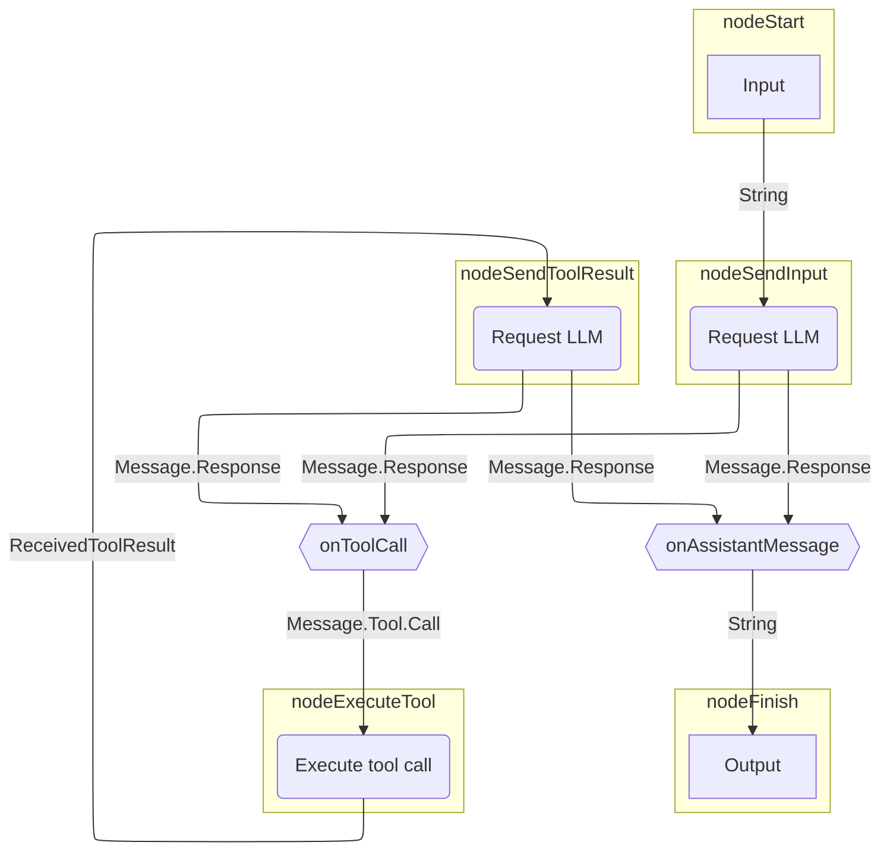
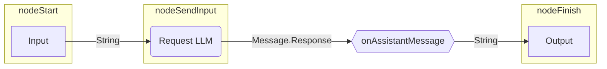

<!-- koog-zh-meta: {"last_synced_at": "2026-03-28T12:53:24+00:00", "source_path": "agents/graph-based-agents.md", "source_sha256": "608d1d49268d4bab31419e1be49cd48da5d7b5049c41207321a46e5652119c0d", "source_tag": "0.7.3", "translation_status": "changed"} -->
# 基于图的智能体 { #graph-based-agents }

通过基于图的智能体，您可以将行为建模为显式的状态机：
图策略的节点代表操作（LLM 调用、工具执行），
边代表节点之间的数据流。

基于图的智能体的主要优势包括：

- 易于可视化
- 状态持久化
- 可组合的架构

??? note "先决条件"

    --8<-- "quickstart-snippets.md:prerequisites"

    --8<-- "quickstart-snippets.md:dependencies"

    --8<-- "quickstart-snippets.md:api-key"

    本页示例假设您通过 Ollama 在本地运行 Llama 3.2。

本页描述如何重新构建[基础智能体](basic-agents.md)所使用的策略图。
该图会向 LLM 发送请求，然后根据情况执行以下操作：
若 LLM 返回助理消息则直接输出响应；
若 LLM 请求工具调用则执行对应工具。
对于工具调用场景，智能体会将工具执行结果发送给 LLM，
随后根据返回内容决定输出响应或继续执行工具。

以下是策略图的示意图：



## 构建策略图 { #build-a-strategy-graph }

在 Koog 中，您可以通过 [`AIAgentGraphStrategyBuilder`](https://api.koog.ai/agents/agents-core/ai.koog.agents.core.dsl.builder/-a-i-agent-graph-strategy-builder/index.html) 实现策略。
正如每个节点都定义输入和输出类型，
策略整体也需要定义输入输出类型。
本例假设输入输出类型均为字符串，
这意味着实现该策略的智能体将接收字符串输入并返回字符串输出。

要创建策略，请使用 [`strategy()`](https://api.koog.ai/agents/agents-core/ai.koog.agents.core.dsl.builder/strategy.html) 函数并指定两个泛型作为输入输出类型，
为策略提供唯一标识符，并定义节点与边。

=== "Kotlin"

    ```kotlin
    val calculatorAgentStrategy = strategy<String, String>("Simple calculator") {
        val nodeSendInput by nodeLLMRequest()
        val nodeExecuteTool by nodeExecuteTool()
        val nodeSendToolResult by nodeLLMSendToolResult()

        edge(nodeStart forwardTo nodeSendInput)
        edge(nodeSendInput forwardTo nodeFinish onAssistantMessage { true })
        edge(nodeSendInput forwardTo nodeExecuteTool onToolCall { true })
        edge(nodeExecuteTool forwardTo nodeSendToolResult)
        edge(nodeSendToolResult forwardTo nodeFinish onAssistantMessage { true })
        edge(nodeSendToolResult forwardTo nodeExecuteTool onToolCall { true })
    }
    ```

=== "Java"

    ```java
    var calculatorAgentStrategy = AIAgentGraphStrategy.builder("Simple calculator")
        .withInput(String.class)
        .withOutput(String.class);

    var nodeSendInput = AIAgentNode.llmRequest(true, "nodeSendInput");
    var nodeExecuteTool = AIAgentNode.executeTool("nodeExecuteTool");
    var nodeSendToolResult = AIAgentNode.llmSendToolResult("nodeSendToolResult");

    calculatorAgentStrategy.edge(calculatorAgentStrategy.nodeStart, nodeSendInput);
    calculatorAgentStrategy.edge(AIAgentEdge.builder()
        .from(nodeSendInput)
        .to(calculatorAgentStrategy.nodeFinish)
        .onIsInstance(Message.Assistant.class)
        .transformed(Message.Assistant::getContent)
        .build());
    calculatorAgentStrategy.edge(AIAgentEdge.builder()
        .from(nodeSendInput)
        .to(nodeExecuteTool)
        .onIsInstance(Message.Tool.Call.class)
        .build());
    calculatorAgentStrategy.edge(nodeExecuteTool, nodeSendToolResult);
    calculatorAgentStrategy.edge(AIAgentEdge.builder()
        .from(nodeSendToolResult)
        .to(calculatorAgentStrategy.nodeFinish)
        .onIsInstance(Message.Assistant.class)
        .transformed(Message.Assistant::getContent)
        .build());
    calculatorAgentStrategy.edge(AIAgentEdge.builder()
        .from(nodeSendToolResult)
        .to(nodeExecuteTool)
        .onIsInstance(Message.Tool.Call.class)
        .build());
    ```

此示例仅使用 [预定义节点](../nodes-and-components.md)，但你也可以创建 [自定义节点](../custom-nodes.md)。

每个策略图都必须有一条从`nodeStart`到`nodeFinish`的路径，通过[边](../custom-strategy-graphs.md#edges)连接。边可以设置条件，用于决定何时沿特定边行进。边还可以在将前一个节点的输出传递给下一个节点之前对其进行转换。这对于连接输出和输入类型不匹配的节点是必需的。

在前面的例子中，`onToolCall { true }` 表示仅当上一个节点返回了工具调用 `Message.Tool.Call` 时，该边才会被遵循。

在使用`onAssistantMessage { true }`时，仅当上一个节点返回了助手消息`Message.Assistant`时，边才会被跟随。此函数还会提取助手消息的内容，从而将`Message.Assistant`转换为`String`，因为`nodeFinish`期望接收字符串。

!!! tip

    除了使用`onAssistantMessage {true}`，您还可以采取以下方式：

    ```kotlin
    onIsInstance(Message.Assistant::class) transformed { it.content }
    ```

    Or:

    ```kotlin
    onCondition { it is Message.Assistant } transformed { it.asAssistantMessage().content }
    ```

## 创建并运行智能体 { #create-and-run-the-agent }

让我们用这个策略创建一个智能体实例并运行它：

=== "Kotlin"

    ```kotlin
    val calculatorAgentStrategy = strategy<String, String>("Simple calculator") {
        val nodeSendInput by nodeLLMRequest()
        val nodeExecuteTool by nodeExecuteTool()
        val nodeSendToolResult by nodeLLMSendToolResult()

        edge(nodeStart forwardTo nodeSendInput)
        edge(nodeSendInput forwardTo nodeFinish onAssistantMessage { true })
        edge(nodeSendInput forwardTo nodeExecuteTool onToolCall { true })
        edge(nodeExecuteTool forwardTo nodeSendToolResult)
        edge(nodeSendToolResult forwardTo nodeFinish onAssistantMessage { true })
        edge(nodeSendToolResult forwardTo nodeExecuteTool onToolCall { true })
    }

    val mathAgent = AIAgent(
        promptExecutor = simpleOllamaAIExecutor(),
        llmModel = OllamaModels.Meta.LLAMA_3_2,
        strategy = calculatorAgentStrategy
    )

    fun main() = runBlocking {
        val result = mathAgent.run("Multiply 3 by 4, then multiply the result by 5, then add 10, then add 123.")
        println(result)
    }
    ```

=== "Java"

    ```java
    var calculatorAgentStrategy = AIAgentGraphStrategy.builder("Simple calculator")
        .withInput(String.class)
        .withOutput(String.class);

    var nodeSendInput = AIAgentNode.llmRequest(true, "nodeSendInput");
    var nodeExecuteTool = AIAgentNode.executeTool("nodeExecuteTool");
    var nodeSendToolResult = AIAgentNode.llmSendToolResult("nodeSendToolResult");

    calculatorAgentStrategy.edge(calculatorAgentStrategy.nodeStart, nodeSendInput);
    calculatorAgentStrategy.edge(AIAgentEdge.builder()
        .from(nodeSendInput)
        .to(calculatorAgentStrategy.nodeFinish)
        .onIsInstance(Message.Assistant.class)
        .transformed(Message.Assistant::getContent)
        .build());
    calculatorAgentStrategy.edge(AIAgentEdge.builder()
        .from(nodeSendInput)
        .to(nodeExecuteTool)
        .onIsInstance(Message.Tool.Call.class)
        .build());
    calculatorAgentStrategy.edge(nodeExecuteTool, nodeSendToolResult);
    calculatorAgentStrategy.edge(AIAgentEdge.builder()
        .from(nodeSendToolResult)
        .to(calculatorAgentStrategy.nodeFinish)
        .onIsInstance(Message.Assistant.class)
        .transformed(Message.Assistant::getContent)
        .build());
    calculatorAgentStrategy.edge(AIAgentEdge.builder()
        .from(nodeSendToolResult)
        .to(nodeExecuteTool)
        .onIsInstance(Message.Tool.Call.class)
        .build());

    var promptExecutor = PromptExecutor.builder()
        .ollama("http://localhost:11434")
        .build();

    AIAgent<String, String> mathAgent = AIAgent.builder()
        .promptExecutor(promptExecutor)
        .llmModel(OllamaModels.Meta.LLAMA_3_2)
        .graphStrategy(calculatorAgentStrategy.build())
        .build();

        String result = mathAgent.run("Multiply 3 by 4, then multiply the result by 5, then add 10, then add 123.", null);
        System.out.println(result);
    ```

当你运行这个智能体时，它会返回类似这样的响应：

```text
To calculate this, I'll follow the order of operations:

1. Multiply 3 by 4: 3 * 4 = 12
2. Multiply the result by 5: 12 * 5 = 60
3. Add 10: 60 + 10 = 70
4. Add 123: 70 + 123 = 193

The final answer is 193.
```

然而，由于该智能体没有任何工具，LLM 始终不会返回工具调用，而是直接生成完整答案。实际发生的情况如下：



尽管在这种情况下答案是正确的，但结果仍取决于底层LLM的算术能力。为确保计算准确，我们应当为智能体提供数学工具。这样LLM就能决定调用可确定性执行计算的相关工具。

## 添加工具 { #add-tools }

定义用于执行数学运算的[工具](../tools-overview.md)，并将其添加到[工具注册表](https://api.koog.ai/agents/agents-tools/ai.koog.agents.core.tools/-tool-registry/index.html)中：

=== "Kotlin"

    ```kotlin
    @LLMDescription("Tools for performing math operations")
    class MathTools : ToolSet {
        @Tool
        @LLMDescription("Adds two numbers and returns the result")
        fun add(a: Int, b: Int): Int {
            // This is not necessary, but it helps to see the tool call in the console output
            println("Adding $a and $b...")
            return a + b
        }
        @Tool
        @LLMDescription("Multiplies two numbers and returns the result")
        fun multiply(a: Int, b: Int): Int {
            // This is not necessary, but it helps to see the tool call in the console output
            println("Multiplying $a and $b...")
            return a * b
        }
    }

    val toolRegistry = ToolRegistry {
        tools(MathTools())
    }
    ```

=== "Java"

    ```java
    @LLMDescription("Tools for performing math operations")
    public static class MathTools implements ToolSet {
        @Tool
        @LLMDescription("Adds two numbers and returns the result")
        public int add(int a, int b) {
            // This is not necessary, but it helps to see the tool call in the console output
            System.out.println("Adding " + a + " and " + b + "...");
            return a + b;
        }

        @Tool
        @LLMDescription("Multiplies two numbers and returns the result")
        public int multiply(int a, int b) {
            // This is not necessary, but it helps to see the tool call in the console output
            System.out.println("Multiplying " + a + " and " + b + "...");
            return a * b;
        }
    }
    public static void main(String[] args) {
        ToolRegistry toolRegistry = ToolRegistry.builder()
            .tools(new MathTools())
            .build();
    }
    ```

将工具注册表添加到智能体配置中：

=== "Kotlin"

    ```kotlin
    val mathAgent = AIAgent(
        promptExecutor = simpleOllamaAIExecutor(),
        llmModel = OllamaModels.Meta.LLAMA_3_2,
        strategy = calculatorAgentStrategy,
        toolRegistry = toolRegistry
    )

    fun main() = runBlocking {
        val result = mathAgent.run("Multiply 3 by 4, then multiply the result by 5, then add 10, then add 123.")
        println(result)
    }
    ```

=== "Java"

    ```java
    AIAgent<String, String> mathAgent = AIAgent.builder()
        .promptExecutor(promptExecutor)
        .llmModel(OllamaModels.Meta.LLAMA_3_2)
        .graphStrategy(calculatorAgentStrategy.build())
        .toolRegistry(toolRegistry)
        .build();

    String result = mathAgent.run("Multiply 3 by 4, then multiply the result by 5, then add 10, then add 123.", null);
    System.out.println(result);
    ```

现在运行智能体时，它会返回类似这样的响应：

```text
Multiplying 3 and 4...
The output from the first operation was multiplied by 5:
5 * 12 = 60

Then, 10 was added to the result:
60 + 10 = 70

Finally, 123 was added to the result:
70 + 123 = 193
```

根据此输出，智能体正确执行了计算，但它仅调用了一次`multiply`工具，而未对每个运算调用相应的工具。我们可以通过描述智能体角色并在系统提示中提供使用适当工具的说明来帮助智能体。

## 提供一条系统提示 { #provide-a-system-prompt }

一个[系统提示](../prompts/prompt-creation/index.md#system-message)定义了智能体的角色和执行任务的指令。在我们的示例中，重要的是描述智能体应如何处理复杂的多步骤计算：

=== "Kotlin"

    ```kotlin
    val mathAgent = AIAgent(
        promptExecutor = simpleOllamaAIExecutor(),
        llmModel = OllamaModels.Meta.LLAMA_3_2,
        systemPrompt = """
                    You are a simple calculator assistant.
                    You can add and multiply two numbers using the 'add' and 'multiply' tools.
                    When the user provides input, extract the numbers and operations they requested.
                    Use the appropriate tool for the first operation, then the next one, and so on, until you calculate the result.
                    Always respond with a clear, friendly message showing the calculation and result.
                    """.trimIndent(),
        toolRegistry = toolRegistry,
        strategy = calculatorAgentStrategy
    )

    fun main() = runBlocking {
        val result = mathAgent.run("Multiply 3 by 4, then multiply the result by 5, then add 10, then add 123.")
        println(result)
    }
    ```

=== "Java"

    ```java
    AIAgent<String, String> mathAgent = AIAgent.builder()
        .promptExecutor(promptExecutor)
        .llmModel(OllamaModels.Meta.LLAMA_3_2)
        .systemPrompt("You are a simple calculator assistant. You can add and multiply two numbers using the 'add' and 'multiply' tools. When the user provides input, extract the numbers and operations they requested. Use the appropriate tool for the first operation, then the next one, and so on, until you calculate the result. Always respond with a clear, friendly message showing the calculation and result.")
        .graphStrategy(calculatorAgentStrategy.build())
        .toolRegistry(toolRegistry)
        .build();

    String result = mathAgent.run("Multiply 3 by 4, then multiply the result by 5, then add 10, then add 123.", null);
    System.out.println(result);
    ```

现在运行智能体时，它会返回类似这样的响应：

```text
Multiplying 3 and 4...
Multiplying 12 and 5...
Adding 60 and 10...
Adding 70 and 123...
The final result is: 193
```

如您所见，智能体现在能够正确调用每个操作对应的工具，确保以确定性的方式执行计算，从而避免了产生幻觉结果的风险。

## 下一步 { #next-steps }

- 与[功能智能体](functional-agents.md)和[规划智能体](planner-agents/index.md)相比
- 通过[安装功能](../features/index.md)增强您的智能体
- 通过[结构化输出](../structured-output.md)提升可预测性与可靠性