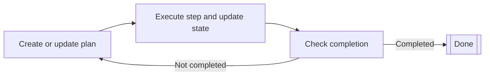

<!-- koog-zh-meta: {"last_synced_at": "2026-03-28T12:51:09+00:00", "source_path": "agents/planner-agents/index.md", "source_sha256": "ff973ef7e37d78c71e7539666dd73cef98b89326028a1defd880ce074b4a083d", "source_tag": "0.7.3", "translation_status": "changed"} -->
# 规划型智能体 { #planner-agents }

规划型智能体是通过迭代式规划循环来规划并执行多步骤任务的AI智能体。
它们持续构建或更新计划、执行步骤，并根据当前状态检查完成标准。

规划型智能体适用于需要将高层目标拆分为更小可执行步骤，
并根据每一步的结果调整计划的复杂任务。

与[基于图的智能体](../graph-based-agents.md)需要定义所有节点和边不同，
对于规划型智能体，您只需定义带有类型化输入和输出的操作（节点）。
规划器会创建适合达成目标状态的合理连接边，
并能在步骤间更新最优路径。
这使得规划型智能体具备更动态的特性，
相较于基于图的智能体更强大，但可控性相对较低。

规划型智能体通过迭代式规划循环运作：

1. 规划器根据当前状态创建或更新计划。
2. 规划器执行计划中的单个步骤，并更新状态。
3. 规划器根据当前状态判断计划是否完成。
    - 若计划已完成，循环结束。
    - 若计划未完成，则从第一步开始重复循环。

Koog提供两种类型的规划型智能体：

- [基于LLM的规划器](llm-based-planners.md)使用LLM来创建和更新计划
- [GOAP智能体](goap-agents.md)采用特殊算法来确定最优操作序列