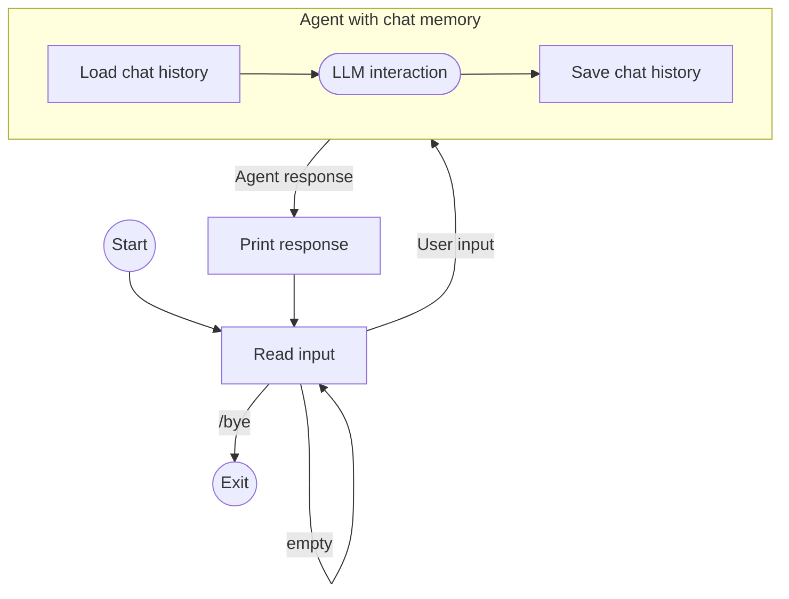

<!-- koog-zh-meta: {"last_synced_at": "2026-03-28T12:59:31+00:00", "source_path": "features/chat-memory/chat-agent-with-memory.md", "source_sha256": "c8ba945bb113e19bd19bd4e7b64e3b88cbc8c08cb6ed83ebbe0abfa1f832b2c1", "source_tag": "0.7.3", "translation_status": "changed"} -->
# 构建具有记忆功能的聊天助手 { #build-a-chat-agent-with-memory }

本指南演示如何利用 [ChatMemory](index.md) 功能创建一个能够跨多次交互记住历史对话内容的命令行聊天应用。

该 CLI 应用执行以下循环：

- 从控制台读取用户输入
- 若输入不是 `/bye` 且非空，则使用用户输入和指定会话 ID 运行助手
- 助手首先加载该会话 ID 对应的历史对话记录，并将消息与用户输入一同加入提示词
- 助手执行 LLM 交互
- 在运行结束返回响应前，助手将完整对话历史存储至指定会话 ID 下，并限制仅保留最新的 20 条消息
- 应用随后输出助手的响应

流程示意图如下：



## 代码实现 { #code }

??? note "前置准备"

    --8<-- "quickstart-snippets.md:prerequisites"

    添加主 [Koog 助手包](https://central.sonatype.com/artifact/ai.koog/koog-agents/)
    及 [聊天记忆功能包](https://mvnrepository.com/artifact/ai.koog/agents-features-memory)
    作为依赖项：

    === "Gradle (Kotlin)"
    
        ```kotlin title="build.gradle.kts"
        dependencies {
            implementation("ai.koog:koog-agents:0.7.0")
            implementation("ai.koog:agents-features-memory:0.7.0")
        }
        ```
    
    === "Gradle (Groovy)"
    
        ```groovy title="build.gradle"
        dependencies {
            implementation 'ai.koog:koog-agents:0.7.0'
            implementation 'ai.koog:agents-features-memory:0.7.0'
        }
        ```
    
    === "Maven"
    
        ```xml title="pom.xml"
        <dependency>
            <groupId>ai.koog</groupId>
            <artifactId>koog-agents-jvm</artifactId>
            <version>0.7.0</version>
        </dependency>
        <dependency>
            <groupId>ai.koog</groupId>
            <artifactId>agents-features-memory-jvm</artifactId>
            <version>0.7.0</version>
        </dependency>
        ```

    --8<-- "quickstart-snippets.md:api-key"

    本页示例假设您已设置 `OPENAI_API_KEY` 环境变量。

=== "Kotlin"

    <!--- INCLUDE
    import ai.koog.agents.chatMemory.feature.ChatMemory
    import ai.koog.agents.chatMemory.feature.InMemoryChatHistoryProvider
    import ai.koog.agents.core.agent.AIAgent
    import ai.koog.prompt.executor.clients.openai.OpenAIModels
    import ai.koog.prompt.executor.llms.all.simpleOpenAIExecutor
    -->
    ```kotlin
    suspend fun main() {
        val sessionId = "my-conversation"

        simpleOpenAIExecutor(System.getenv("OPENAI_API_KEY")).use { executor ->
            val agent = AIAgent(
                promptExecutor = executor,
                llmModel = OpenAIModels.Chat.GPT5_2,
                systemPrompt = "You are a helpful assistant."
            ) {
                install(ChatMemory) {
                    windowSize(20) // 仅保留最近20条消息
                }
            }

            while (true) {
                print("You: ")
                val input = readln().trim()
                if (input == "/bye") break
                if (input.isEmpty()) continue

                val reply = agent.run(input, sessionId)
                println("Assistant: $reply\n")
            }
        }
    }
    ```

=== "Java"

    ```java
    public class ExampleChatAgentOpenAI {
        public static void main(String[] args) {
            String sessionId = "my-conversation";
    
```            try (var executor = simpleOpenAIExecutor(System.getenv("OPENAI_API_KEY"))) {
                AIAgent<String, String> agent = AIAgent.builder()
                        .promptExecutor(executor)
                        .llmModel(OpenAIModels.Chat.GPT5_2)
                        .systemPrompt("你是一个乐于助人的助手。")
                        .install(ChatMemory.Feature, config -> {
                            config.windowSize(20); // 仅保留最近的20条消息
                        })
                        .build();
    
                Scanner scanner = new Scanner(System.in);
                while (true) {
                    System.out.print("你: ");
                    String input = scanner.nextLine().trim();
                    if (input.equals("/bye")) break;
                    if (input.isEmpty()) continue;
    
                    String reply = agent.run(input, sessionId);
                    System.out.println("助手: " + reply + "\n");
                }
            } catch (Exception e) {
                e.printStackTrace();
            }
        }
    }
    ```

## 实现细节 { #implementation-details }

`agent.run()` 的第二个参数是用于识别和区分不同对话的[会话ID](index.md#session-ids)。
在我们的示例中，由于每次只有一个对话，因此该ID保持恒定。
在实际应用中，可以为同一用户的相关对话分配独立的唯一ID。

该代理使用默认的[历史记录提供器](index.md#history-providers)，
该提供器将对话历史存储在内存中。
这意味着当应用程序退出时，历史记录会丢失。
在实际应用中，应实现自定义的历史记录提供器，
以便将历史记录持久化存储到数据库或文件中。

`windowSize(20)` [预处理器](index.md#preprocessors)确保上下文大小受限：
代理仅存储最多20条最新消息。
若无此限制，提示词大小可能超出上下文限制。

## 示例会话 { #example-session }

```
You: My name is Alice.
Assistant: Nice to meet you, Alice! How can I help you today?

You: What's my favorite color? It's blue.
Assistant: Got it — your favorite color is blue!

You: What's my name?
Assistant: Your name is Alice!
```

尽管每次交互都是独立的代理运行，但代理仍能正确回答“你的名字是Alice！”，
这是因为`ChatMemory`功能在处理第三条消息前加载了先前的对话记录。