<!-- koog-zh-meta: {"last_synced_at": "2026-03-28T13:05:24+00:00", "source_path": "nodes-and-components.md", "source_sha256": "e4cd496c59a9d5393bee0cc0f291c78c5eaa898c11d92f3504935dcc37028bbe", "source_tag": "0.7.3", "translation_status": "changed"} -->
# 预定义节点与组件 { #predefined-nodes-and-components }

节点是 Koog 框架中智能体工作流的基础构建块。
每个节点代表工作流中的一个特定操作或转换，它们可以通过边连接起来，以定义执行流程。

通常，节点允许你将复杂逻辑封装成可复用的组件，这些组件可以轻松集成到不同的智能体工作流中。本指南将引导你了解现有节点，这些节点可用于你的智能体策略。

每个节点本质上是一个函数，它接收特定类型的输入，并返回特定类型的输出。

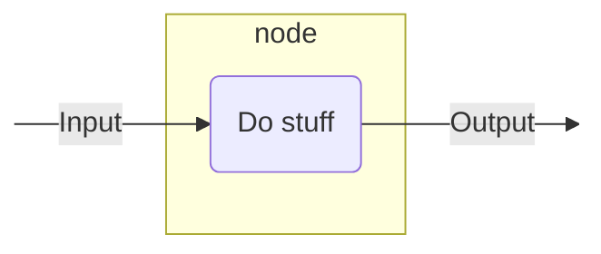

以下是如何定义一个节点，它期望字符串作为输入，并返回字符串长度（整数）作为输出：

=== "Kotlin"
    ```kotlin
    val nodeLength by node<String, Int> { input ->
        input.length
    }
    ```

=== "Java"

    ```java
    var nodeLength = AIAgentNode.builder("nodeLength")
        .withInput(String.class)
        .withOutput(Integer.class)
        .withAction((input, ctx) -> input.length())
        .build();
    ```

更多信息，请参阅 [`node()`](api:agents-core::ai.koog.agents.core.dsl.builder.AIAgentSubgraphBuilderBase.node)。

## 实用节点 { #utility-nodes }

### nodeDoNothing { #nodedonothing }

一个简单的直通节点，不执行任何操作，直接将输入作为输出返回。详情请参阅 [API 参考](api:agents-core::ai.koog.agents.core.dsl.extension.nodeDoNothing)。

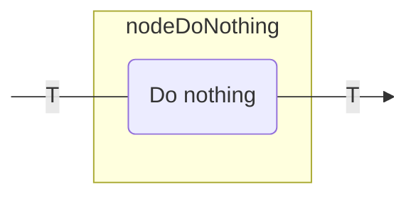

你可以将此节点用于以下目的：

- 在图中创建占位节点。
- 创建不修改数据的连接点。

以下是一个示例：

=== "Kotlin"

    ```kotlin
    val passthrough by nodeDoNothing<String>("passthrough")

    edge(nodeStart forwardTo passthrough)
    edge(passthrough forwardTo nodeFinish)
    ```

=== "Java"
    
    ```java
    var passthrough = AIAgentNode.doNothing(String.class);

    strategy.edge(strategy.nodeStart, passthrough);
    strategy.edge(passthrough, strategy.nodeFinish);
    ```

## LLM 节点 { #llm-nodes }

### nodeAppendPrompt { #nodeappendprompt }

一个使用提供的提示构建器向 LLM 提示添加消息的节点。
这在发出实际的 LLM 请求之前修改对话上下文时非常有用。详情请参阅 [API 参考](api:agents-core::ai.koog.agents.core.dsl.extension.nodeUpdatePrompt)。

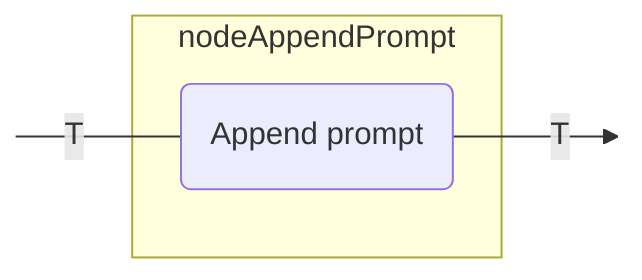

你可以将此节点用于以下目的：

- 向提示添加系统指令。
- 在对话中插入用户消息。
- 为后续的 LLM 请求准备上下文。

以下是一个示例：

=== "Kotlin"

    ```kotlin
    val firstNode by node<Input, Output> {
        // 将输入转换为输出
    }

    val secondNode by node<Output, Output> {
        // 将输出转换为输出
    }

    // 节点将从前一个节点获取类型为 Output 的输入值，并将其传递给下一个节点
    val setupContext by nodeAppendPrompt<Output>("setupContext") {
        system("您是一位专注于 Kotlin 编程的助手。")
        user("我需要关于 Kotlin 协程的帮助。")
    }

    edge(firstNode forwardTo setupContext)
    edge(setupContext forwardTo secondNode)
    ```

=== "Java"

```java
var firstNode = AIAgentNode.builder()
    .withInput(Input.class)
    .withOutput(Output.class)
    .withAction((input, ctx) -> {
        // 将输入转换为输出
        return input;
    })
    .build();

var secondNode = AIAgentNode.builder()
    .withInput(Output.class)
    .withOutput(Output.class)
    .withAction((output, ctx) -> {
        // 将输出转换为输出
        return output;
    })
    .build();

var setupContext = AIAgentNode.builder()
    .withInput(Output.class)
    .appendPrompt(prompt -> {
        prompt.system("You are a helpful assistant specialized in Kotlin programming.");
        prompt.user("I need help with Kotlin coroutines.");
    });

strategy.edge(firstNode, setupContext);
strategy.edge(setupContext, secondNode);
```

### nodeLLMSendMessageOnlyCallingTools { #nodellmsendmessageonlycallingtools }

一个向 LLM 提示追加用户消息并获取响应的节点，其中 LLM 只能调用工具。详情请参阅 [API 参考](api:agents-core::ai.koog.agents.core.dsl.extension.nodeLLMSendMessageOnlyCallingTools)。

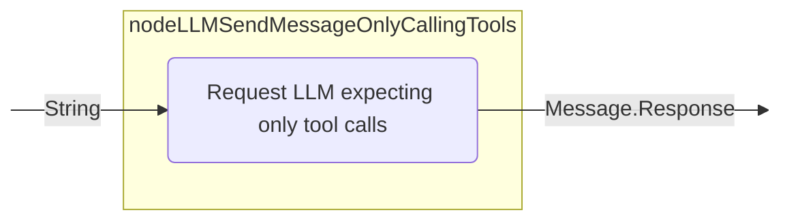

### nodeLLMSendMessageForceOneTool { #nodellmsendmessageforceonetool }

一个向 LLM 提示追加用户消息并强制 LLM 使用特定工具的节点。详情请参阅 [API 参考](api:agents-core::ai.koog.agents.core.dsl.extension.nodeLLMSendMessageForceOneTool)。

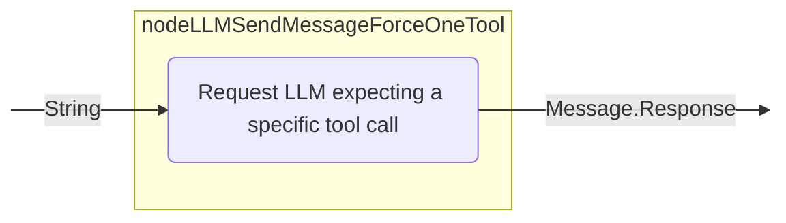

### nodeLLMRequest { #nodellmrequest }

一个向 LLM 提示追加用户消息并获取响应（可选包含工具使用）的节点。节点配置决定在处理消息期间是否允许工具调用。详情请参阅 [API 参考](api:agents-core::ai.koog.agents.core.dsl.extension.nodeLLMRequest)。

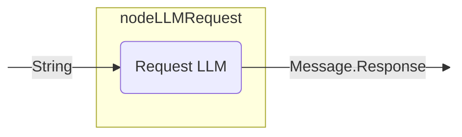

您可以将此节点用于以下目的：

- 为当前提示生成 LLM 响应，控制是否允许 LLM 生成工具调用。

示例如下：

=== "Kotlin"

```kotlin
val requestLLM by nodeLLMRequest("requestLLM", allowToolCalls = true)
edge(getUserQuestion forwardTo requestLLM)
```

=== "Java"

```java
var requestLLM = AIAgentNode.llmRequest(true, "requestLLM");

strategy.edge(getUserQuestion, requestLLM);
```

### nodeLLMRequestStructured { #nodellmrequeststructured }

这是一个将用户消息附加到 LLM 提示中，并向具有纠错能力的 LLM 请求结构化数据的节点。详情请参阅 [API 参考](api:agents-core::ai.koog.agents.core.dsl.extension.nodeLLMRequestStructured)。

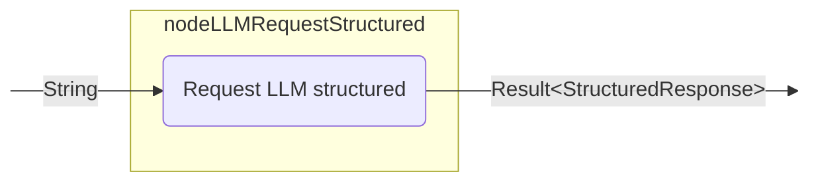

### 节点 LLMRequestStreaming { #nodellmrequeststreaming }

一个节点，将用户消息附加到 LLM 提示中，并流式传输 LLM 响应，可选择是否进行流数据转换。详情请参阅 [API 参考](api:agents-core::ai.koog.agents.core.dsl.extension.nodeLLMRequestStreaming)。

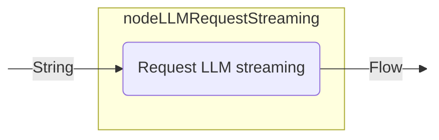

### 节点 LLMRequestMultiple { #nodellmrequestmultiple }

一个节点，将用户消息附加到 LLM 提示中，并获取启用了工具调用的多个 LLM 响应。详情请参阅 [API 参考](api:agents-core::ai.koog.agents.core.dsl.extension.nodeLLMRequestMultiple)。

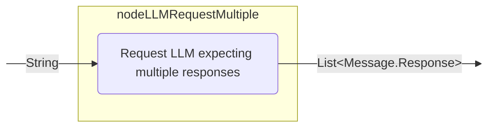

您可以将此节点用于以下目的：

- 处理需要多次工具调用的复杂查询。
- 生成多个工具调用。
- 实现需要多个并行操作的工作流。

以下是一个示例：

=== "Kotlin"

    ```kotlin
    val requestLLMMultipleTools by nodeLLMRequestMultiple()
    edge(getComplexUserQuestion forwardTo requestLLMMultipleTools)
    ```

=== "Java"

    ```java
    var requestLLMMultipleTools = AIAgentNode.llmRequestMultiple("requestLLMMultipleTools");

    strategy.edge(getComplexUserQuestion, requestLLMMultipleTools);
    ```

### 节点 LLMCompressHistory { #nodellmcompresshistory }

一个节点，将当前的 LLM 提示（消息历史）压缩为摘要，用简洁的摘要（TL;DR）替换消息。详情请参阅 [API 参考](api:agents-core::ai.koog.agents.core.dsl.extension.nodeLLMCompressHistory)。
这对于管理长对话非常有用，通过压缩历史记录来减少令牌使用量。

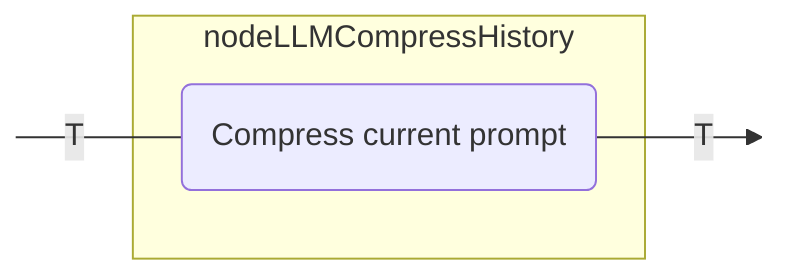

要了解更多关于历史压缩的信息，请参阅 [历史压缩](history-compression.md)。

您可以将此节点用于以下目的：

- 管理长对话以减少令牌使用量。
- 总结对话历史以保持上下文。
- 在长时间运行的智能体中实现内存管理。

以下是一个示例：

=== "Kotlin"

    ```kotlin
    val compressHistory by nodeLLMCompressHistory<String>(
        "compressHistory",
        strategy = HistoryCompressionStrategy.FromLastNMessages(10),
        preserveMemory = true
    )
    edge(generateHugeHistory forwardTo compressHistory)
    ```

=== "Java"
    
    ```java
    var compressHistory = AIAgentNode.llmCompressHistory("compressHistory")
        .withInput(String.class)
        .build();

    strategy.edge(generateHugeHistory, compressHistory);
    ```

## 工具节点 { #tool-nodes }

### nodeExecuteTool { #nodeexecutetool }

一个执行单个工具调用并返回其结果的节点。此节点用于处理由 LLM 发起的工具调用。详情请参阅 [API 参考](api:agents-core::ai.koog.agents.core.dsl.extension.nodeExecuteTool)。

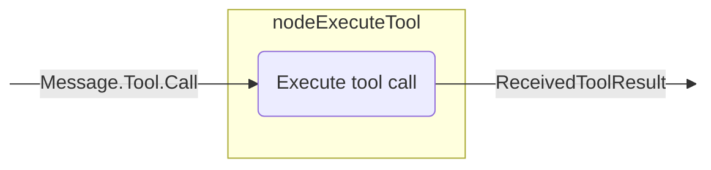

您可以将此节点用于以下目的：

- 执行由 LLM 请求的工具。
- 响应 LLM 决策处理特定操作。
- 将外部功能集成到智能体工作流中。

以下是一个示例：

=== "Kotlin"

    ```kotlin
    val requestLLM by nodeLLMRequest()
    val executeTool by nodeExecuteTool()
    edge(requestLLM forwardTo executeTool onToolCall { true })
    ```

=== "Java"

    ```java
    var requestLLM = AIAgentNode.llmRequest(true, "requestLLM");
    var executeTool = AIAgentNode.executeTool("executeTool");

    strategy.edge(AIAgentEdge.builder()
        .from(requestLLM)
        .to(executeTool)
        .onIsInstance(Message.Tool.Call.class)
        .build());
    ```

### nodeLLMSendToolResult { #nodellmsendtoolresult }

一个将工具执行结果添加到提示中并请求 LLM 响应的节点。详细信息请参阅 [API 参考](api:agents-core::ai.koog.agents.core.dsl.extension.nodeLLMSendToolResult)。

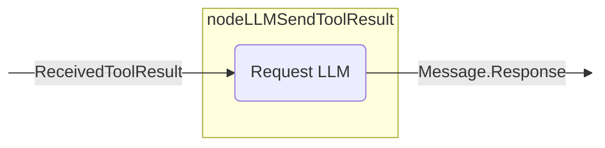

您可以将此节点用于以下目的：

- 处理工具执行的结果。
- 基于工具输出生成响应。
- 在工具执行后继续对话。

以下是一个示例：

=== "Kotlin"

    ```kotlin
    val executeTool by nodeExecuteTool()
    val sendToolResultToLLM by nodeLLMSendToolResult()
    edge(executeTool forwardTo sendToolResultToLLM)
    ```

=== "Java"
    
    ```java
    var executeTool = AIAgentNode.executeTool("executeTool");
    var sendToolResultToLLM = AIAgentNode.llmSendToolResult("sendToolResultToLLM");

    strategy.edge(executeTool, sendToolResultToLLM);
    ```

### nodeExecuteMultipleTools { #nodeexecutemultipletools }

一个执行多个工具调用的节点。这些调用可以选择并行执行。详细信息请参阅 [API 参考](api:agents-core::ai.koog.agents.core.dsl.extension.nodeExecuteMultipleTools)。

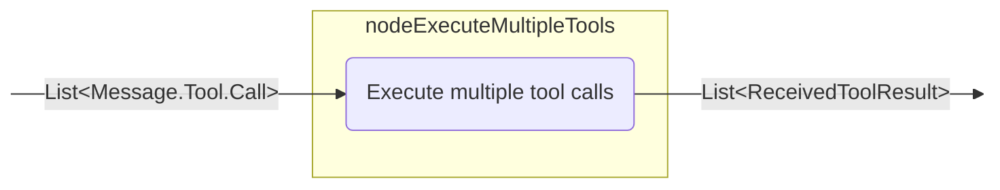

您可以将此节点用于以下目的：

- 并行执行多个工具。
- 处理需要多个工具执行的复杂工作流。
- 通过批量处理工具调用来优化性能。

以下是一个示例：

=== "Kotlin"

    ```kotlin
    val requestLLMMultipleTools by nodeLLMRequestMultiple()
    val executeMultipleTools by nodeExecuteMultipleTools()
    edge(requestLLMMultipleTools forwardTo executeMultipleTools onMultipleToolCalls { true })
    ```

=== "Java"

    ```java
    var requestLLMMultipleTools = AIAgentNode.llmRequestMultiple("requestLLMMultipleTools");
    var executeMultipleTools = AIAgentNode.executeMultipleTools(false, "executeMultipleTools");    // 从响应列表中提取工具调用
    strategy.edge(AIAgentEdge.builder()
        .from(requestLLMMultipleTools)
        .to(executeMultipleTools)
        .onCondition(responses -> responses.stream()
            .anyMatch(msg -> msg instanceof Message.Tool.Call))
        .transformed(responses -> responses.stream()
            .filter(msg -> msg instanceof Message.Tool.Call)
            .map(msg -> (Message.Tool.Call) msg)
            .toList())
        .build());
    ```

### 节点LLMSendMultipleToolResults { #nodellmsendmultipletoolresults }

一个将多个工具结果添加到提示中并获取多个LLM响应的节点。详情请参阅[API参考](api:agents-core::ai.koog.agents.core.dsl.extension.nodeLLMSendMultipleToolResults)。

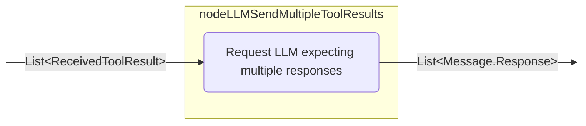

您可以使用此节点实现以下目的：

- 处理多个工具执行的结果。
- 生成多个工具调用。
- 实现具有多个并行操作的复杂工作流。

以下是一个示例：

=== "Kotlin"

    ```kotlin
    val executeMultipleTools by nodeExecuteMultipleTools()
    val sendMultipleToolResultsToLLM by nodeLLMSendMultipleToolResults()
    edge(executeMultipleTools forwardTo sendMultipleToolResultsToLLM)
    ```

=== "Java"
    
    ```java
    var executeMultipleTools = AIAgentNode.executeMultipleTools(false, "executeMultipleTools");
    var sendMultipleToolResultsToLLM = AIAgentNode.llmSendMultipleToolResults("sendMultipleToolResultsToLLM");

    strategy.edge(executeMultipleTools, sendMultipleToolResultsToLLM);
    ```

## 节点输出转换 { #node-output-transformation }

框架提供了`transform`扩展函数，允许您创建节点的转换版本，这些版本会对其输出应用转换。这在需要将节点的输出转换为不同类型或格式，同时保留原始节点功能时非常有用。

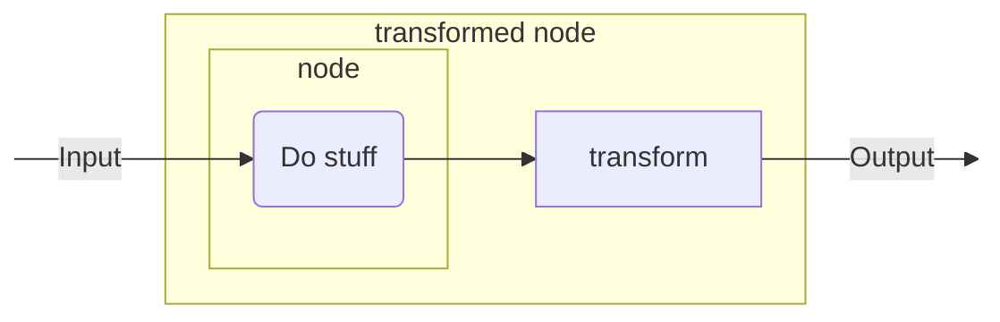

### transform { #transform }

[`transform()`](api:agents-core::ai.koog.agents.core.dsl.builder.AIAgentNodeDelegate.transform)函数创建一个新的`AIAgentNodeDelegate`，它包装原始节点并对其输出应用转换函数。

=== "Kotlin"

    ```kotlin
    inline fun <reified T> AIAgentNodeDelegate<Input, Output>.transform(
        noinline transformation: suspend (Output) -> T
    ): AIAgentNodeDelegate<Input, T>
    ```

=== "Java"

    ```java
    // 在Java中，您需要使用AIAgentNode.builder()和显式类型参数
    // 手动组合具有转换逻辑的节点。
    // 有关节点转换的Java方法，请参阅以下示例。
    ```

#### 自定义节点转换 { #custom-node-transformation }

将自定义节点的输出转换为不同的数据类型：

=== "Kotlin"

    ```kotlin
    val textNode by nodeDoNothing<String>("textNode").transform<Int> { text ->
        text.split(" ").filter { it.isNotBlank() }.size
    }

    edge(nodeStart forwardTo textNode)
    edge(textNode forwardTo nodeFinish)
    ```

=== "Java"
    
    ```java
    var textNode = AIAgentNode.builder("textNode")
        .withInput(String.class)
        .withOutput(Integer.class)
        .withAction((text, ctx) -> {
            String[] words = text.split(" ");
            int count = 0;
            for (String word : words) {
                if (!word.isBlank()) {
                    count++;
                }
            }
            return count;
        })
        .build();

    strategy.edge(strategy.nodeStart, textNode);
    strategy.edge(textNode, strategy.nodeFinish);
    ```

#### 内置节点转换 { #built-in-node-transformation }

转换内置节点（如 `nodeLLMRequest`）的输出：

=== "Kotlin"

    ```kotlin
    val lengthNode by nodeLLMRequest("llmRequest").transform<Int> { assistantMessage ->
        assistantMessage.content.length
    }

    edge(nodeStart forwardTo lengthNode)
    edge(lengthNode forwardTo nodeFinish)
    ```

=== "Java"
    
    ```java
    var llmRequest = AIAgentNode.llmRequest(true, "llmRequest");
    var lengthNode = AIAgentNode.builder("lengthNode")
        .withInput(Message.Response.class)
        .withOutput(Integer.class)
        .withAction((assistantMessage, ctx) -> {
            if (assistantMessage instanceof Message.Assistant) {
                return ((Message.Assistant) assistantMessage).getContent().length();
            }
            return 0;
        })
        .build();

    strategy.edge(strategy.nodeStart, llmRequest);
    strategy.edge(llmRequest, lengthNode);
    strategy.edge(lengthNode, strategy.nodeFinish);
    ```

## 预定义子图 { #predefined-subgraphs }

框架提供了预定义的子图，这些子图封装了常用的模式和流程。通过自动处理基础节点和边的创建，这些子图简化了复杂智能体策略的开发。

使用预定义子图，您可以实现多种流行的流程。以下是一个示例：

1. 准备数据。
2. 执行任务。
3. 验证任务结果。如果结果不正确，则返回步骤 2 并附带反馈信息进行调整。

### subgraphWithTask { #subgraphwithtask }

一个使用提供的工具执行特定任务并返回结构化结果的子图。它支持多响应 LLM 交互（助手可能产生多个与工具调用交错的响应），并允许您控制工具调用的执行方式。详情请参阅 [API 参考](api:agents-ext::ai.koog.agents.ext.agent.subgraphWithTask)。

您可以使用此子图实现以下目的：

- 创建处理大型工作流中特定任务的专用组件。
- 封装具有清晰输入输出接口的复杂逻辑。
- 配置特定于任务的工具、模型和提示。
- 通过自动压缩管理对话历史。
- 开发结构化的智能体工作流和任务执行流程。
- 从 LLM 任务执行生成结构化结果，包括包含多个助手响应和工具调用的流程。

API 允许您通过可选参数微调执行：- runMode：控制任务期间工具调用的执行方式（默认为顺序执行）。当底层模型/执行器支持时，可使用此参数在不同工具执行策略之间切换。
- assistantResponseRepeatMax：限制在判定任务无法完成之前允许的助手响应次数（如果未提供，则默认为安全的内部限制）。

您可以将任务以文本形式提供给子图，根据需要配置 LLM，并提供必要的工具，子图将处理并解决该任务。示例如下：

=== "Kotlin"

    ```kotlin
    val processQuery by subgraphWithTask<String, String>(
        tools = listOf(searchTool, calculatorTool, weatherTool),
        llmModel = OpenAIModels.Chat.GPT4o,
        runMode = ToolCalls.SEQUENTIAL,
        assistantResponseRepeatMax = 3,
    ) { userQuery ->
        """
        You are a helpful assistant that can answer questions about various topics.
        Please help with the following query:
        $userQuery
        """
    }
    ```

=== "Java"
    
    ```java
    var processQuery = AIAgentSubgraph.builder("processQuery")
        .limitedTools(List.of(searchTool, calculatorTool, weatherTool))
        .withInput(String.class)
        .withOutput(String.class)
        .withTask(userQuery ->
            "You are a helpful assistant that can answer questions about various topics.\n" +
            "Please help with the following query:\n" +
            userQuery)
        .build();
    ```

### subgraphWithVerification { #subgraphwithverification }

`subgraphWithTask` 的特殊版本，用于验证任务是否正确执行，并提供遇到的问题详情。该子图适用于需要验证或质量检查的工作流。详细信息请参阅 [API 参考](api:agents-ext::ai.koog.agents.ext.agent.subgraphWithVerification)。

您可以将此子图用于以下目的：

- 验证任务执行的正确性。
- 在工作流中实施质量控制流程。
- 创建自验证组件。
- 生成包含成功/失败状态及详细反馈的结构化验证结果。

该子图确保 LLM 在工作流结束时调用验证工具，以检查任务是否成功完成。它保证验证作为最终步骤执行，并返回一个 `CriticResult`，用于指示任务是否成功完成并提供详细反馈。
示例如下：

=== "Kotlin"

    ```kotlin
    val verifyCode by subgraphWithVerification<String>(
        tools = listOf(runTestsTool, analyzeTool, readFileTool),
        llmModel = AnthropicModels.Opus_4_6,
        runMode = ToolCalls.SEQUENTIAL,
        assistantResponseRepeatMax = 3,
    ) { codeToVerify ->
        """
        You are a code reviewer. Please verify that the following code meets all requirements:
        1. It compiles without errors
        2. All tests pass
        3. It follows the project's coding standards

        Code to verify:
        $codeToVerify
        """
    }
    ```

=== "Java"

    ```java
    var verifyCode = AIAgentSubgraph.builder("verifyCode")
    .limitedTools(List.of(runTestsTool, analyzeTool, readFileTool))
    .withInput(String.class)
    .withVerification(codeToVerify ->
        "You are a code reviewer. Please verify that the following code meets all requirements:\n" +
        "1. It compiles without errors\n" +
        "2. All tests pass\n" +
        "3. It follows the project's coding standards\n\n" +
        "Code to verify:\n" +
        codeToVerify)
    .build();
    ```

## 预定义策略与常见策略模式 { #predefined-strategies-and-common-strategy-patterns }

该框架提供了预定义的策略，这些策略组合了多种节点。
节点通过边连接以定义操作流程，并附带条件来指定何时遵循每条边。

如有需要，您可以将这些策略集成到您的智能体工作流中。

### 单次运行策略 { #single-run-strategy }

单次运行策略专为非交互式用例设计，其中智能体处理一次输入并返回结果。

当您需要运行不需要复杂逻辑的简单流程时，可以使用此策略。

=== "Kotlin"

    ```kotlin
    public fun singleRunStrategy(): AIAgentGraphStrategy<String, String> = strategy("single_run") {
        val nodeCallLLM by nodeLLMRequest("sendInput")
        val nodeExecuteTool by nodeExecuteTool("nodeExecuteTool")
        val nodeSendToolResult by nodeLLMSendToolResult("nodeSendToolResult")

        edge(nodeStart forwardTo nodeCallLLM)
        edge(nodeCallLLM forwardTo nodeExecuteTool onToolCall { true })
        edge(nodeCallLLM forwardTo nodeFinish onAssistantMessage { true })
        edge(nodeExecuteTool forwardTo nodeSendToolResult)
        edge(nodeSendToolResult forwardTo nodeFinish onAssistantMessage { true })
        edge(nodeSendToolResult forwardTo nodeExecuteTool onToolCall { true })
    }
    ```

=== "Java"
    
    ```java
    public static AIAgentGraphStrategy<String, String> singleRunStrategy() {
        var strategy = AIAgentGraphStrategy.builder("single_run")
            .withInput(String.class)
            .withOutput(String.class);

        var nodeCallLLM = AIAgentNode.llmRequest(true, "sendInput");
        var nodeExecuteTool = AIAgentNode.executeTool("nodeExecuteTool");
        var nodeSendToolResult = AIAgentNode.llmSendToolResult("nodeSendToolResult");

        strategy.edge(strategy.nodeStart, nodeCallLLM);

        strategy.edge(AIAgentEdge.builder()
            .from(nodeCallLLM)
            .to(nodeExecuteTool)
            .onIsInstance(Message.Tool.Call.class)
            .build());

        strategy.edge(AIAgentEdge.builder()
            .from(nodeCallLLM)
            .to(strategy.nodeFinish)
            .onIsInstance(Message.Assistant.class)
            .transformed(Message.Assistant::getContent)
            .build());
        strategy.edge(nodeExecuteTool, nodeSendToolResult);

        strategy.edge(AIAgentEdge.builder()
            .from(nodeSendToolResult)
            .to(strategy.nodeFinish)
            .onIsInstance(Message.Assistant.class)
            .transformed(Message.Assistant::getContent)
            .build());

        strategy.edge(AIAgentEdge.builder()
            .from(nodeSendToolResult)
            .to(nodeExecuteTool)
            .onIsInstance(Message.Tool.Call.class)
            .build());

        return strategy.build();
    }
    ```

### 基于工具的策略 { #tool-based-strategy }

基于工具的策略专为严重依赖工具执行特定操作的工作流设计。
它通常根据 LLM 决策执行工具并处理结果。

=== "Kotlin"

    ```kotlin
    fun toolBasedStrategy(name: String, toolRegistry: ToolRegistry): AIAgentGraphStrategy<String, String> {
        return strategy(name) {
            val nodeSendInput by nodeLLMRequest()
            val nodeExecuteTool by nodeExecuteTool()
            val nodeSendToolResult by nodeLLMSendToolResult()

            // 定义智能体的流程
            edge(nodeStart forwardTo nodeSendInput)

            // 若 LLM 以消息响应，则结束
            edge(
                (nodeSendInput forwardTo nodeFinish)
                        onAssistantMessage { true }
            )

            // 若 LLM 调用工具，则执行该工具
            edge(
                (nodeSendInput forwardTo nodeExecuteTool)
                        onToolCall { true }
            )

            // 将工具结果发送回 LLM
            edge(nodeExecuteTool forwardTo nodeSendToolResult)

            // 若 LLM 调用另一个工具，则执行该工具
            edge(
                (nodeSendToolResult forwardTo nodeExecuteTool)
                        onToolCall { true }
            )

            // 若 LLM 以消息响应，则结束
            edge(
                (nodeSendToolResult forwardTo nodeFinish)
                        onAssistantMessage { true }
            )
        }
    }
    ```

=== "Java"
    
    ```java
    public static AIAgentGraphStrategy<String, String> toolBasedStrategy(String name, ToolRegistry toolRegistry) {
        var strategy = AIAgentGraphStrategy.builder(name)
            .withInput(String.class)
            .withOutput(String.class);

        var nodeSendInput = AIAgentNode.llmRequest(true, "nodeSendInput");
        var nodeExecuteTool = AIAgentNode.executeTool("nodeExecuteTool");
        var nodeSendToolResult = AIAgentNode.llmSendToolResult("nodeSendToolResult");

        // 定义智能体的流程
        strategy.edge(strategy.nodeStart, nodeSendInput);

        // 若 LLM 以消息响应，则结束
        strategy.edge(AIAgentEdge.builder()
            .from(nodeSendInput)
            .to(strategy.nodeFinish)
            .onIsInstance(Message.Assistant.class)
            .transformed(Message.Assistant::getContent)
            .build());        // 如果 LLM 调用了工具，则执行它
        strategy.edge(AIAgentEdge.builder()
            .from(nodeSendInput)
            .to(nodeExecuteTool)
            .onIsInstance(Message.Tool.Call.class)
            .build());

        // 将工具执行结果发送回 LLM
        strategy.edge(nodeExecuteTool, nodeSendToolResult);

        // 如果 LLM 调用了另一个工具，则执行它
        strategy.edge(AIAgentEdge.builder()
            .from(nodeSendToolResult)
            .to(nodeExecuteTool)
            .onIsInstance(Message.Tool.Call.class)
            .build());

        // 如果 LLM 以消息形式响应，则结束流程
        strategy.edge(AIAgentEdge.builder()
            .from(nodeSendToolResult)
            .to(strategy.nodeFinish)
            .onIsInstance(Message.Assistant.class)
            .transformed(Message.Assistant::getContent)
            .build());

        return strategy.build();
    }
    ```

### 流式数据策略 { #streaming-data-strategy }

流式数据策略专为处理来自 LLM 的流式数据而设计。它通常请求流式数据，进行处理，并可能使用处理后的数据调用工具。

=== "Kotlin"

    ```kotlin
    val agentStrategy = strategy<String, List<Book>>("library-assistant") {
        // 描述包含输出流解析的节点
        val getMdOutput by node<String, List<Book>> { booksDescription ->
            val books = mutableListOf<Book>()
            val mdDefinition = markdownBookDefinition()

            llm.writeSession {
                appendPrompt { user(booksDescription) }
                // 以定义 `mdDefinition` 的形式启动响应流
                val markdownStream = requestLLMStreaming(mdDefinition)
                // 使用响应流的结果调用解析器，并对结果执行操作
                parseMarkdownStreamToBooks(markdownStream).collect { book ->
                    books.add(book)
                    println("Parsed Book: ${book.title} by ${book.author}")
                }
            }

            books
        }
        // 描述智能体的图结构，确保节点可访问
        edge(nodeStart forwardTo getMdOutput)
        edge(getMdOutput forwardTo nodeFinish)
    }
    ```

=== "Java"

    ```java
    var strategy = AIAgentGraphStrategy.builder()
        .withInput(String.class)
        .withOutput(List.class);

    var getMdOutput = AIAgentNode.builder()
        .withInput(String.class)
        .<List<Book>>withOutput(TypeToken.of(new TypeCapture<List<Book>>() {}))
        .withAction((booksDescription, ctx) -> {
            var books = new ArrayList<Book>();
            StructureDefinition mdDefinition = markdownBookDefinition();

            ctx.getLlm().writeSession(session -> {
                session.appendPrompt(prompt -> {
                    prompt.user(booksDescription);
                });                // 以定义 `mdDefinition` 的形式启动响应流
                var markdownStream = session.requestLLMStreaming(mdDefinition);
                // 使用响应流的结果调用解析器，并对结果执行操作
                parseMarkdownStreamToBooks(markdownStream).subscribe(new Flow.Subscriber<>() {
                    @Override
                    public void onSubscribe(Flow.Subscription subscription) {
                    }

                    @Override
                    public void onNext(Book book) {
                        books.add(book);
                        System.out.println("已解析书籍: " + book.getTitle() + " 作者: " + book.getAuthor());
                    }

                    @Override
                    public void onError(Throwable throwable) {
                    }

                    @Override
                    public void onComplete() {
                    }
                });

                return null;
            });

            return books;
        })
        .build();

    strategy.edge(strategy.nodeStart, getMdOutput);
    strategy.edge(getMdOutput, strategy.nodeFinish);
    ```
