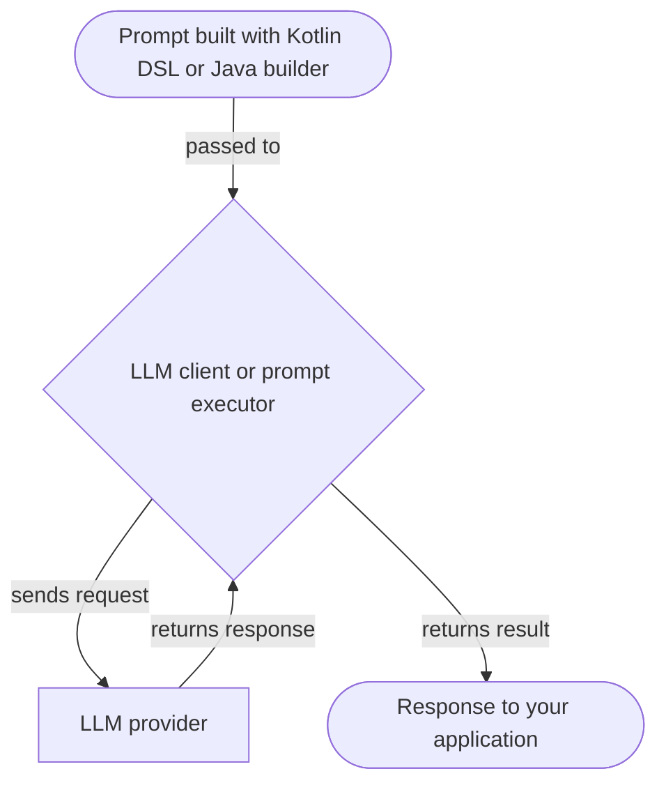
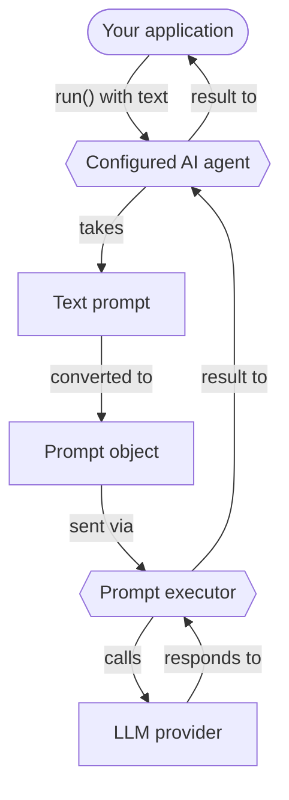

<!-- koog-zh-meta: {"last_synced_at": "2026-03-28T13:06:20+00:00", "source_path": "prompts/index.md", "source_sha256": "0a9eb7870b9b31fa43b0997aaf37a5022900804e3f9a38ddae877759719e0c1c", "source_tag": "0.7.3", "translation_status": "changed"} -->
# 提示词 { #prompts }

提示词是指导大型语言模型（LLM）生成回复的指令。
它们定义了您与LLM交互的内容和结构。
本节介绍如何使用Koog创建和运行提示词。

## 创建提示词 { #creating-prompts }

在 Koog 中，提示词是 `Prompt` 数据类的实例，具有以下属性：

- `id`：提示词的唯一标识符。
- `messages`：表示与LLM对话的消息列表。
- `params`：可选的[LLM配置参数](prompt-creation/index.md#prompt-parameters)（例如温度、工具选择等）。

虽然您可以直接实例化`Prompt`类，
但推荐的创建提示词方式是使用[Kotlin DSL](prompt-creation/index.md)或Java构建器API，
它们提供了定义对话的结构化方式。

!!! note
    本页的Kotlin示例使用Kotlin DSL。Java示例使用`Prompt.builder("id")`构建器，并酌情使用`system(...)`、`user(...)`、`assistant(...)`、`toolCall(...)`、`toolResult(...)`和`withOutput(Foo.class)`等显式方法。

=== "Kotlin"

    ```kotlin
    val myPrompt = prompt("hello-koog") {
        system("You are a helpful assistant.")
        user("What is Koog?")
    }
    ```

=== "Java"

    ```java
    var myPrompt = Prompt.builder("hello-koog")
        .system("You are a helpful assistant.")
        .user("What is Koog?")
        .build();
    ```

!!! note
    AI智能体可以接收简单的文本提示作为输入。它们会自动将文本提示转换为Prompt对象，并发送给LLM执行。这对于[基础智能体](../agents/basic-agents.md)非常有用，因为它只需要运行单个请求，无需复杂的对话逻辑。

## 运行提示词 { #running-prompts }

Koog 提供了两个抽象层级来针对LLM运行提示：LLM客户端和提示词执行器。两者都接受提示对象，并可用于直接执行提示，无需AI智能体。客户端和执行器的执行流程是相同的：



<div class="grid cards" markdown>

-   :material-arrow-right-bold:{ .lg .middle } [**LLM clients**](llm-clients.md)

    ---

    用于直接与特定 LLM 提供程序交互的低层级接口。适用于仅需操作单一提供程序且无需高级生命周期管理的场景。

-   :material-swap-horizontal:{ .lg .middle } [**Prompt executors**](prompt-executors.md)

    ---

    管理一个或多个LLM客户端生命周期的高级抽象。当您需要一个统一的API来跨多个提供商运行提示，并支持动态切换和回退机制时，请使用它们。

</div>

## 优化性能与处理故障 { #optimizing-performance-and-handling-failures }

Koog 允许您在运行提示时优化性能并处理故障。

<div class="grid cards" markdown>

-   :material-cached:{ .lg .middle } [**LLM response caching**](llm-response-caching.md)

    ---

    缓存LLM的响应以优化性能并降低重复请求的成本。

-   :material-shield-check:{ .lg .middle } [**Handling failures**](handling-failures.md)

    ---

    在您的应用程序中使用内置的重试机制、超时设置以及其他错误处理功能。

</div>

## AI 智能体中的提示词 { #prompts-in-ai-agents }

在Koog中，AI智能体在其生命周期内维护和管理提示。虽然LLM客户端或执行器用于运行提示，但智能体负责处理提示更新的流程，确保对话历史保持相关性和一致性。

智能体中的提示生命周期通常包含以下几个阶段：

1. Initial prompt setup.
2. Automatic prompt updates.
3. Context window management.
4. Manual prompt management.

### 初始提示设置 { #initial-prompt-setup }

当你[初始化一个智能体](../quickstart.md#create-your-first-koog-agent)时，可以定义一个[系统消息](prompt-creation/index.md#system-message)来设定智能体的行为。随后，当你调用智能体的`run()`方法时，通常需要提供一个初始的[用户消息](prompt-creation/index.md#user-messages)作为输入。这些消息共同构成了智能体的初始提示。例如：

=== "Kotlin"

    ```kotlin
    // Create an agent
    val agent = AIAgent(
        promptExecutor = simpleOpenAIExecutor(apiKey),
        systemPrompt = "You are a helpful assistant.",
        llmModel = OpenAIModels.Chat.GPT4o
    )

    // Run the agent
    val result = agent.run("What is Koog?")
    ```

=== "Java"

    ```java
    AIAgent<String, String> agent = AIAgent.builder()
        .promptExecutor(simpleOpenAIExecutor(System.getenv("OPENAI_API_KEY")))
        .systemPrompt("You are a helpful assistant. Answer user questions concisely.")
        .llmModel(OpenAIModels.Chat.GPT4o)
        .build();

    var result = agent.run("What is Koog?");
    ```

在这个示例中，智能体自动将文本提示转换为 Prompt 对象，并将其发送给提示词执行器：



对于更高级的配置，您也可以使用 [AIAgentConfig](api:agents-core::ai.koog.agents.core.agent.config.AIAgentConfig) 来定义智能体的初始提示。

### 自动提示更新 { #automatic-prompt-updates }

当智能体执行其策略时，[预定义节点](../nodes-and-components.md) 会自动更新提示。例如：

- [`nodeLLMRequest`](../nodes-and-components.md#nodellmrequest): 将用户消息附加到提示中并捕获 LLM 的响应。
- [`nodeLLMSendToolResult`](../nodes-and-components.md#nodellmsendtoolresult): 将工具执行结果附加到对话中。
- [`nodeAppendPrompt`](../nodes-and-components.md#nodeappendprompt): 在流程的任何节点向提示词中插入特定消息。

### 上下文窗口管理 { #context-window-management }

为避免在长时间交互中超出LLM上下文窗口，智能体可利用[历史压缩](../history-compression.md)功能。

### 手动提示管理 { #manual-prompt-management }

对于复杂的工作流，您可以使用[LLM 会话](../sessions.md)手动管理提示。在智能体策略或自定义节点中，您可以使用`llm.writeSession`来访问和修改`Prompt`对象。这使您能够根据需要添加、删除或重新排序消息。
